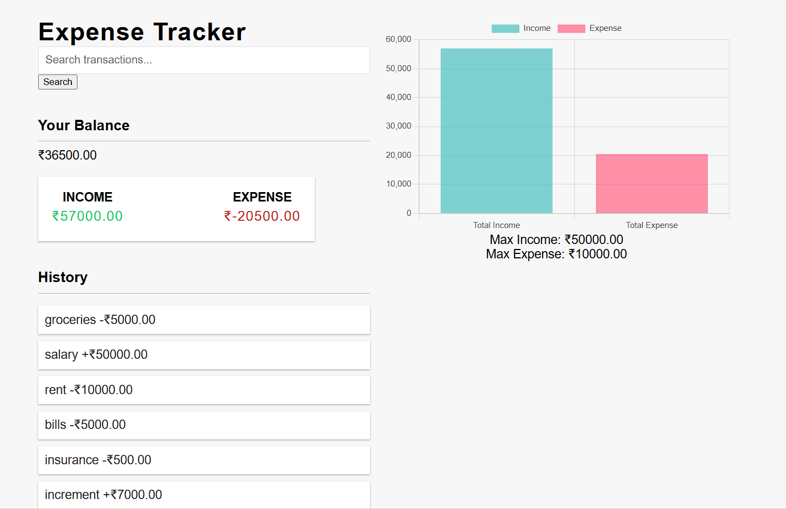
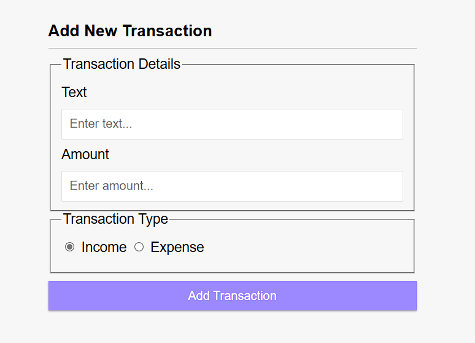

# Expense Tracker

A simple web application to track your expenses and income. This application allows you to add transactions, view your balance, and see a chart representation of your income and expenses.

## Features

- Add income and expense transactions
- View your current balance
- Display a list of all transactions
- Visualize income and expenses using a bar chart
- Persistent storage using local storage

## Technologies Used

- HTML
- CSS
- JavaScript
- Chart.js

## Installation

1. Clone the repository:
   ```sh
   git clone https://github.com/your-username/expense-tracker.git

2. Navigate to the project directory:
    ```sh
    cd expense-tracker
3. Open index.html in your web browser.

## Usage
Enter a description for your transaction in the "Text" field.
Enter the amount for your transaction in the "Amount" field. Use a negative value for expenses and a positive value for income.
Click the "Add Transaction" button to add the transaction to the list.
View your balance, income, and expenses, as well as the chart representation of your transactions.

## Files
index.html - The main HTML file that contains the structure of the application.
style.css - The CSS file that contains the styles for the application.
app.js - The JavaScript file that contains the logic for the application.

## ScreenShots




